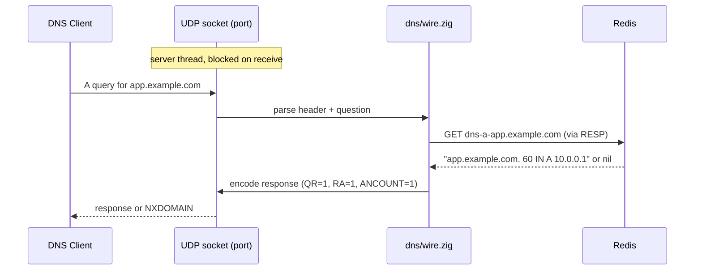
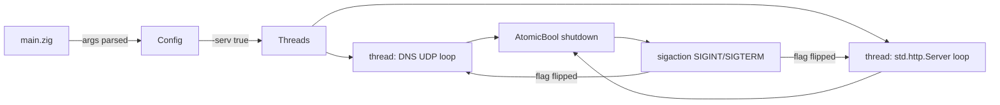

# feat: Zig implementation of Cicada-style DNS server (zicada)

## Summary

Build `zicada` — a Zig 0.16 single-binary clone of Go-based cicada — exposing CLI add, UDP DNS (A-record query + simplified nsupdate UPDATE), HTTP batch API, and Redis storage. Implementation is hand-rolled DNS/RESP wire codecs in pure Zig stdlib; runs on macOS dev and Linux production.

---

## Problem Frame

The Go version of cicada works but its dynamic binary is ~10 MB, slowing deployment in CI/CD pipelines and making cross-platform builds expensive. Re-implementing in Zig gives a smaller static binary, native cross-compilation, and lower memory footprint — at the cost of writing DNS and RESP codecs by hand (see origin for the full motivation).

---

## Requirements

- R1. CLI mode adds a single DNS A record (`-name`, `-ip`, `-ttl`, `-days`)
- R2. HTTP API: `PUT /api/dns/a` accepts JSON array of `[{name, ip}]`, returns `ok\n`, `Content-Type: text/plain; charset=utf-8`
- R3. UDP DNS server on configurable port (default 1353) responds to A queries from Redis
- R4. Accepts RFC 2136 UPDATE (opcode 5) with no TSIG, no prereq check; class=ANY + rdlength=0 → Del, else Set with default expiry
- R5. Redis storage: key format `dns-a-<lowercase-name>`, value = zone-text representation of A RR, 7-day TTL (configurable via `-days`)
- R6. `-serv` mode runs DNS on `port` and HTTP on `port+1` concurrently
- R7. Signal handling (SIGINT/SIGTERM) triggers graceful shutdown of both servers
- R8. CLI flags `-port` (default 1353), `-dsn` (default `redis://localhost:6379/0`), `-name`, `-ip`, `-ttl` (60s in RR), `-days` (7d in Redis), `-serv` (false), `-net` (udp|tcp; tcp deferred)
- R9. Per-unit `**Files:**`, `**Verification:**`, and `**Test scenarios:**` below trace back to Acceptance Examples AE1-AE4 from origin.

**Origin actors:** A1 (CI/CD pipeline), A2 (operator), A3 (nsupdate client), A4 (DNS query client)
**Origin flows:** F1 (CLI add), F2 (HTTP add), F3 (DNS query), F4 (nsupdate update)
**Origin acceptance examples:** AE1 (covers R1), AE2 (covers R2), AE3 (covers R3), AE4 (covers R4)

---

## Scope Boundaries

- Only A records (no AAAA, CNAME, MX, SOA, NS)
- Only UDP transport (TCP declared "deferred for later" by origin)
- nsupdate UPDATE only — no AXFR/IXFR, no Notify-as-prerequisite, no TSIG
- No zone transfer support, no DNSSEC
- Single-process, no event-loop framing in v1 (two threads + atomic shutdown flag)
- No rate limiting, no ACLs, no authentication
- Redis is the only supported storage
- Single binary — no plugin or extension points

### Deferred to Follow-Up Work

- TCP DNS listener (origin-deferred product work; would extend U5 + U8)
- AAAA and other record types (origin-deferred product work)
- Full RFC 2136 compliance including prereq checks (origin-deferred product work)
- Container image and CI release pipeline (separate from this plan; defer until binary is stable)

---

## Context & Research

### Relevant Code and Patterns

- `/go/src/hyyl.xyz/cupola/cicada/main.go` lines 44-87: CLI flag surface, server-mode bootstrap, graceful shutdown sequencing
- `/go/src/hyyl.xyz/cupola/cicada/mux.go` lines 37-87, 89-100, 120-226: Redis key layout (`dns-a-<lower-name>`), 7-day Redis expiry with 60-second RR TTL, custom DNS message acceptance (Query/Notify/Update only), HTTP JSON shape, no-TSIG/no-prereq UPDATE handling
- Zig 0.16 stdlib: `std.Io.net.Socket` for UDP, `std.http.Server` for HTTP, `std.Io.Threaded` for CLI binary, `std.json` for parsing, `std.process.Args` iterator for arg walks

### External References

- Zig 0.16 release notes — `Io-as-an-Interface` section drives `std.net` API choices
- RFC 1035 §4.1 (DNS message format), §4.1.3 (question/answer RR layout)
- RFC 2136 §2-§3.4 (UPDATE message structure)
- Redis RESP2 protocol — minimal 4-command subset (SET, GET, DEL, PING)

---

## Key Technical Decisions

- **Hand-rolled arg walker over vendored CLI lib.** Zig 0.16 deliberately ships no CLI parser (`std.process.Args` is just an iterator) per upstream issue #24510. A flag walker covers ~30 LoC and avoids the dependency burden.
- **Two threads + atomic shutdown over std.Io.EventLoop.** Cicada uses goroutines; matching that shape keeps mental model parity. std.Io.EventLoop is the right primitive for future scaling work but adds capability cost that is not justified by this workload.
- **Hand-written RESP state machine over Redis client library.** A 4-command subset (SET, GET, DEL, PING) parses in ~50 LoC. Pulling a client (e.g., `karlseguin/zio`) violates the "no external deps" stance the user confirmed.
- **No DNS name compression in v1.** Pointer compression (`0xC0 <offset>`) saves bytes but adds a parser state machine. Origin behavior uses `dns.NewRR(s)` which un-marshals uncompressed zone-text from Redis, so the server can always answer with `0xC0 0x0C` pointers back to the question section.
- **Redis value = zone-text A RR (e.g. `app.example.com. 60 IN A 10.0.0.1`).** Matches origin's `dns.NewRR(s)` round-trip; storing only the IP string would lose the RR structure needed by future record types (deferred).
- **TTL split preserved exactly:** Redis key expiry = `days × 24h` (default 7d); DNS response TTL field = `60s`. Matches origin `defaultDays` and `defaultTTL` semantics.
- **HTTP server on `port + 1`.** Matches origin at `main.go:67-69`.

---

## Open Questions

### Resolved During Planning

- [Opcodes accepted in DNS server]: include Notify alongside Query and Update (matching origin); cost is negligible
- [Server-mode concurrency model]: two threads + atomic flag; std.Io.EventLoop deferred
- [CLI parser]: hand-rolled flag walker; no dependency
- [Redis client]: hand-written RESP2 state machine; no dependency

### Deferred to Implementation

- Exact socket buffer sizing for maximum UDP datagram: depends on platform `SO_RCVBUF` defaults; tune once observed
- HTTP body size limit: matching origin's 256 KiB header cap; body cap can be smaller — set after measuring worst-case batch payload
- DNS response compression strategy for names: origin stores full zone-text so v1 can answer with a single 0xC0 0x0C pointer per answer; revisit when AAAA is added

---

## Output Structure

    build.zig
    build.zig.zon
    src/
      main.zig            # entry, dispatch (CLI vs server), signal wiring
      config.zig          # CLI flags + defaults, Config struct
      log.zig             # minimal structured logger (t,l,m + fields)
      util.zig            # lower/trim-dot/IPv4 parse helpers
      redis.zig           # RESP2 client (connect, set, get, del, ping)
      dns/
        wire.zig          # encode/decode DNS header + question + A answer
        server.zig        # UDP listener, ServeDNS loop, opcode dispatch
        update.zig        # RFC 2136 UPDATE handling (zone + rrset walk)
      http/
        server.zig        # std.http.Server, PUT /api/dns/a handler
    tests/
      wire_test.zig
      redis_test.zig
      cli_add_test.zig
      update_test.zig
      http_api_test.zig
    scripts/
      smoke.sh             # AE1-AE4 end-to-end exerciser (uses local redis-server + dig + nsupdate + curl)
    README.md             # rebuild of origin README, minimal

---

## High-Level Technical Design

> *This illustrates the intended approach and is directional guidance for review, not implementation specification. The implementing agent should treat it as context, not code to reproduce.*

Data flow during a single DNS query (UDP) — process shape:

Update flow diverges at the opcode check: opcode 5 (UPDATE) is routed to `update.zig`, which walks `r.Msg.Prerequisite`, `r.Msg.Update` (cicada uses Update only; Prereq is parsed but ignored), and for each RR either `SET` (class=IN) or `DEL` (class=ANY, rdlength=0) in Redis. Response is NOERROR with `ANCOUNT=0`.

Server-mode orchestration:

---

## Implementation Units

### U1. Build setup and Config

**Goal:** Build the runnable binary skeleton with CLI flag parsing and a working `Config` struct that downstream units consume.

**Requirements:** R8 (CLI flag surface and defaults)

**Dependencies:** None

**Files:**
- Create: `build.zig` (replace stub — add `install` + `run` steps for binary target)
- Create: `build.zig.zon` (add `main_module_source_files`, dependencies)
- Create: `src/main.zig` (entry point, dispatch to CLI add-mode or server-mode based on flags)
- Create: `src/config.zig` (`Config` struct + `parse(allocator, args) !Config`)
- Create: `src/util.zig` (`lower(allocator, s)`, `trimDot(name)`, `parseIPv4(s)`)

**Approach:**
- Use `std.process.Args` iterator; flag walker recognises `--flag=value` and `-flag value` forms, returns `!Config` with sensible defaults mirroring origin (`-port=1353`, `-dsn=redis://localhost:6379/0`, `-ttl=60`, `-days=7`, `-serv=false`, `-net=udp`)
- Config normalisation: lowercase `-dsn` host portion not required (origin passes verbatim to `redis.ParseURL`); leave to Redis client
- `main.zig` decides dispatch: if `-name && -ip` → CLI add path (U3); else if `-serv` → server path (U8); else print usage and exit

**Test scenarios:**
- Happy path: `zicada -name foo -ip 10.0.0.1` parses to a Config with `name=foo`, `ip=10.0.0.1`, `days=7`, `ttl=60`
- Edge case: `-port=0` rejected; `-days=0` rejected (Redis `EX 0` is invalid)
- Error path: missing `-name` (when `-ip` present) → returns `error.MissingFlag` to stderr + usage exit
- Error path: unknown `-flag` → returns `error.UnknownFlag`

**Verification:**
- `zig build run -- -name test -ip 10.0.0.1` exits 0 *after* U3 is in place; until then the same command exits with "not implemented" cleanly
- Flag walker round-trips a synthetic argv array → struct field equality

---

### U2. Redis RESP client

**Goal:** Connect to Redis over a single TCP socket, issue `PING`, `SET ... EX`, `GET`, `DEL` commands; return typed outcomes including "key missing" for GET.

**Requirements:** R5 (key format), R6 (expiry)

**Dependencies:** U1 (Config.dsn)

**Files:**
- Create: `src/redis.zig` (`Client` with `connect`, `ping`, `set`, `get`, `del`, `close`)
- Create: `tests/redis_test.zig`

**Approach:**
- Use `std.Io.net.Socket` with `.tcp` + `.ipv4`, dial `host:port` parsed from DSN
- RESP2-only: arrays for commands, simple strings, bulk strings, integer replies, nil bulk reply — parse with a hand-written state machine that reads bytes incrementally
- `SET` is sent as a single 6-element array: `SET`, key, value, `EX`, `<ttl_seconds>`, optionally `NX` — pick the variant that matches origin (always overwrites)
- `GET` returns `?[]u8` — `null` for `$-1\r\n` reply, decoded bytes for `$<n>\r\n<n bytes>\r\n`
- `Del` returns integer (1 = deleted, 0 = not present)
- Connection failures bubble as `error.RedisConnectFailed`; protocol errors as `error.RedisProtocolError`

**Test scenarios:**
- Happy path: connected client `PING` returns `+PONG`
- Happy path: `SET foo bar EX 60` returns `+OK`; subsequent `GET foo` returns `bar`; TTL eventually evicts (use `EX 1` in unit test)
- Happy path: `GET missing` returns `null`
- Edge case: `DEL nonexistent` returns integer 0
- Error path: socket close mid-write → `error.RedisProtocolError`
- Error path: parsing `+OK` truncated to `+O` → `error.RedisProtocolError`
- Covers F2 / R6: round-trip SET with `EX` then GET survives a `redis-cli OBJECT IDLETIME` check showing TTL <= 60

**Verification:**
- Against a local redis-server (`redis-server --port 6379 --daemonize yes`): `Client.ping` returns OK; SET/GET/DEL round-trip; TTL applied

---

### U3. CLI add-mode

**Goal:** When `-name` and `-ip` are both provided, write a single A record to Redis and exit 0.

**Requirements:** R1 (CLI add), R5 (key format)

**Dependencies:** U1 (Config), U2 (Client)

**Files:**
- Modify: `src/main.zig` (wire dispatch branch)
- Create: `src/util.zig` exports added: `formatA(name, ttl, ip) []u8` (produces origin-style zone-text, e.g. `app.example.com. 60 IN A 10.0.0.1`)
- Create: `tests/cli_add_test.zig` (best-effort; depends on running redis)

**Approach:**
- Validate IPv4 with `std.net.Ip4Address.parse`; reject malformed
- Construct key: `try allocator.dupe(u8, "dns-a-" ++ lower(trimDot(name)))`
- Construct value via `formatA(name, ttl, ip)`
- `client.set(key, value, ttl_seconds); ttl_seconds = days * 86400`
- On success: log `{key, val}` at info; exit 0
- On Redis failure: log error and exit non-zero

**Test scenarios:**
- Covers AE1: given Redis running, `zicada add -name test -ip 192.168.1.100` → Redis `GET dns-a-test` returns the zone-text A record; key has TTL between 7×86400-1 and 7×86400 seconds
- Edge case: `-name=Test.Example.Com.` → key is `dns-a-test.example.com` (lowercase + trailing dot trimmed)
- Edge case: `-ip=999.0.0.1` → exit 1 with clear error
- Edge case: `-days=0` → exit 1 (U1 already rejects, but defence-in-depth)
- Integration: when key already exists, both `-ttl` and `-days` are honored on overwrite (Redis SET replaces the value, embedding the new RR TTL, and refreshes the key expiry) — matches origin's `mux.go:93` `h.Set(NewA(...))` + `SET ... EX` round-trip

**Verification:**
- `redis-cli GET dns-a-test` returns expected zone-text after CLI invocation
- TTL within the configured window per `redis-cli TTL dns-a-test`

---

### U4. DNS wire codec

**Goal:** Encode and decode DNS messages: 12-byte header, question section with name + qtype + qclass, answer section with compressed-pointer name + A rdata.

**Requirements:** R3 (query response), supports U5/U6 message handling

**Dependencies:** None (pure codec, no I/O)

**Files:**
- Create: `src/dns/wire.zig` (encode/decode functions, `Message` struct)
- Create: `tests/wire_test.zig`

**Approach:**
- `Message { header, questions, answers }` — header is a 12-byte bitfield struct matching RFC 1035 §4.1.1 (ID, QR, OPCODE, AA, TC, RD, RA, Z, AD, CD, RCODE, QDCOUNT, ANCOUNT, NSCOUNT, ARCOUNT)
- `encodeName(buf, name)` writes labels with length prefix; `decodeName(reader, allocator)` reads labels and rejects compression pointers in v1
- `encodeQuestion(buf, q)` and `encodeAnswerA(buf, answer, ttl, ipv4)` produce single-Q single-A payloads; answers use `0xC0 0x0C` back-pointer to the question section
- `decodeQuery(buf, allocator)` returns `!Message` — error on QR=1, OPCODE > 5, QDCOUNT ≠ 1
- Helper: `setRcode(msg, code)` — covers NOERROR=0, FORMERR=1, SERVFAIL=2, NXDOMAIN=3, NOTIMP=4, REFUSED=5

**Test scenarios:**
- Happy path: encode a synthetic query with ID=0x1234, Q=app.example.com A IN → bytes match a hand-rolled expected byte array
- Happy path: decode same bytes → fields equal the originals
- Happy path: encode a response with QR=1 RA=1 ANCOUNT=1 answer A 10.0.0.1 → back-pointer resolves to question
- Edge case: name compression in query is rejected with `error.UnsupportedCompression`
- Edge case: empty name → reject
- Error path: QR=1 in query → reject
- Error path: OPCODE=2 (STATUS) → reject as `error.OpcodeNotImplemented`
- Error path: QDCOUNT=2 → reject
- Covers F3 / R3: round-trip a query, parse the response with this codec too

**Verification:**
- Unit tests pass against synthetic bytes
- `dig @localhost -p 1353 app.example.com A +noedns +noaa` (covered end-to-end in U5) returns an answer parsed by this codec

---

### U5. DNS UDP server

**Goal:** Bind UDP socket on configured port, loop receiving datagrams, dispatch each to Query/Notify/Update handlers, send reply to sender's address.

**Requirements:** R3, R4 (opcode acceptance), R7 (signal gate)

**Dependencies:** U2 (Client), U4 (wire codec)

**Files:**
- Create: `src/dns/server.zig` (`runServer`, opcode dispatch to U6 or local Query path)
- Modify: `src/main.zig` (hosted by server-mode bootstrap in U8)

**Approach:**
- Open `std.Io.net.Socket` with `.udp` + `.ipv4`, bind to `0.0.0.0:port`
- Loop: `socket.receive(io, recv_buf)` blocking; on each datagram, decode via U4; if `opcode == QUERY || opcode == NOTIFY` and `qdcount == 1`, lookup Redis, encode response (NOERROR or NXDOMAIN), `socket.send(io, src_addr, resp_buf)`; if `opcode == UPDATE`, delegate to U6; else respond NOTIMP
- Section caps to mirror origin: ANcount<=1, NScount<=1, ARcount<=2 (origin) — but receiver-side cap on `ar_count` in query to reject malformed at entry
- Loop polls an `Atomic(bool)` shutdown flag between receives; on flag set, returns
- Time budget per datagram: 5 seconds (matches origin's `ReadTimeout=6s` headroom)

**Test scenarios:**
- Happy path: query for known name returns A record (Covers AE3, F3, R3)
- Happy path: query for unknown name returns NXDOMAIN (RCODE=3, ANCOUNT=0)
- Edge case: query with QTYPE=AAAA → return NOERROR with ANCOUNT=0 (origin only answers A; silently drop AAAA questions)
- Edge case: query with QR=1 → respond FORMERR (mirrors origin's reject path)
- Error path: opcode 2 (STATUS) → respond NOTIMP
- Error path: datagram > 512 bytes → drop silently (no reply)
- Error path: malformed header (truncated) → drop silently
- Integration: end-to-end dig test against running server with redis populated

**Verification:**
- `dig @127.0.0.1 -p 1353 app A` returns A record
- `dig @127.0.0.1 -p 1353 missing A` returns NXDOMAIN with status SERVFAIL? — verify NOERROR/ANCOUNT=0
- `kill -TERM $pid` exits cleanly within 1 second (covered end-to-end in U8)

---

### U6. nsupdate UPDATE handler

**Goal:** Parse RFC 2136 UPDATE message, walk the Update section, perform Set or Del on Redis per RR, reply NOERROR.

**Requirements:** R4

**Dependencies:** U2 (Client), U4 (wire decoder), U5 (dispatch)

**Files:**
- Create: `src/dns/update.zig` (`handle(msg, client) !void`)
- Create: `tests/update_test.zig`

**Approach:**
- Decode UPDATE message via U4 codec (parse Prerequisite, Update, Additional sections as RRs even if Prereq/Additional are ignored)
- For each RR in `msg.update_section`:
  - If `class == CLASS_ANY` (`255`) and `rdlength == 0` → `redis.del(key)` where `key = "dns-a-" ++ lower(rr.name)`
  - Else → `redis.set(key, formatA(rr.name, 60, rr.rdata), 7×86400)`; class must be `IN` (`1`); reject other classes with FORMERR
- Construct UPDATE response: header with `QR=1 OPCODE=5 RCODE=0`, copy ID/Counts, no answer records
- The zone section RR is required by RFC 2136 but only its class/type are checked; we don't filter by zone — matches origin behavior

**Test scenarios:**
- Covers AE4: simulated UPDATE adding `app.example.com A 10.0.0.1` → Redis `GET dns-a-app.example.com` returns zone-text A record
- Happy path: UPDATE deleting an existing record (`class=ANY rdlen=0`) removes the key; subsequent GET returns null
- Edge case: UPDATE with `class=IN` but `ttl=0` (no RR TTL field in update rrsets; ignore TTL)
- Edge case: UPDATE with malformed zone RR (not SOA-type) → reply FORMERR
- Error path: opcode != 5 (caller's responsibility but test as defence-in-depth)
- Integration: real `nsupdate` tool drives an UPDATE end-to-end via U5 dispatch

**Verification:**
- `nsupdate -y '' <<<'server 127.0.0.1\nzone example.com\nupdate add foo.example.com 60 A 10.0.0.99\nsend'` succeeds (cicada accepts updates without TSIG — match that)
- After UPDATE, `dig @127.0.0.1 -p 1353 foo.example.com A` returns the added record

---

### U7. HTTP API

**Goal:** Run `std.http.Server` on `port+1`, route `PUT /api/dns/a` to JSON-array decode → batch Redis Set, return `ok\n`.

**Requirements:** R2

**Dependencies:** U2 (Client), U3 (formatA helper)

**Files:**
- Create: `src/http/server.zig` (`runServer`)
- Create: `tests/http_api_test.zig`

**Approach:**
- Bind TCP listener on `port+1`; init `std.http.Server` with the connection stream
- For each accepted connection: parse head; method=GET/HEAD → 204 No Content empty body; method=PUT and path=`/api/dns/a` → read body bounded at 1 MiB (origin: header cap 256 KiB; body cap somewhat larger for batch payloads), `std.json.parseFromSlice([]Record, allocator, body, .{.ignore_unknown_fields = true})`, iterate records, build key `dns-a-<lower-name>`, value via U3 formatA, `client.set(...)`; on per-record failure log info and continue (mirrors origin); respond `200`, `Content-Type: text/plain; charset=utf-8`, body `"ok\n"`
- Method≠PUT or path≠`/api/dns/a` → 400 with `StatusText`
- Body discard is handled internally by `Request.respond()`; no explicit drain needed

**Test scenarios:**
- Covers AE2: `PUT /api/dns/a` with body `[{"name":"app","ip":"10.0.0.5"}]` returns `ok\n`, Redis key present
- Happy path: batch of multiple records → all keys created
- Edge case: empty body `[]` → `ok\n`, no keys created
- Edge case: GET /api/dns/a → 204 No Content
- Error path: PUT `/wrong` → 400
- Error path: malformed JSON (e.g. `{`) → 400 with description, no Redis writes
- Error path: missing `ip` field → that record skipped, others succeed (mirror origin per-record log-and-continue)
- Integration: full request/response with `curl` against running server

**Verification:**
- `curl -X PUT -H 'Content-Type: application/json' -d '[{"name":"app","ip":"10.0.0.5"}]' http://127.0.0.1:1354/api/dns/a` returns `ok\n`
- Subsequent `dig @127.0.0.1 -p 1353 app A` returns the inserted IP

---

### U8. Server-mode orchestration and graceful shutdown

**Goal:** When `-serv` is true, run DNS and HTTP servers concurrently and shut them both down on SIGINT/SIGTERM.

**Requirements:** R6, R7

**Dependencies:** U5 (DNS server), U7 (HTTP server)

**Files:**
- Modify: `src/main.zig` (server-mode entry branch)
- Create: `src/log.zig` (minimal logger; used across units)

**Approach:**
- Spawn two `std.Thread`s: one runs `dns.server.runServer(...)`, other runs `http.server.runServer(...)`
- Register SIGINT/SIGTERM via `std.posix.sigaction(...)` — return is `void` (errno on failure); signal handler body is restricted to setting an `Atomic(bool)` and is otherwise async-signal-safe; do not log from inside the handler
- Each thread loop checks the flag at top of iteration; on flip, returns cleanly
- After both threads `join`, log shutdown complete and exit 0
- Logger: structured minimum `{t,l,m}` plus arbitrary stringly-typed fields; release build uses JSON line output, `dev` version uses pretty (mirrors origin pretty/JSON split via `-ldflags`-equivalent — achieved via Zig build option)

**Test scenarios:**
- Integration: start server, send SIGTERM, both threads exit within 1 second; `dig` after that fails with connection refused
- Integration: start server with `-port=53` (privileged), handler reports bind error clearly without crashing the other thread
- Edge case: SIGINT while a `dig` is mid-flight → request fails predictably, server exits cleanly
- Happy path: SIGINT twice in succession — second one terminates immediately (matches Go default but allow fast-path for impatient operators)

**Verification:**
- `zicada -serv`, then `kill -TERM $pid` → exits 0 in under 1 second
- Logs include startup `{ver,net,port}` line and shutdown completion line

---

### U9. End-to-end smoke harness and CI script

**Goal:** Provide a reproducible smoke script that brings up Redis, builds the binary, and exercises the four acceptance examples.

**Requirements:** All AEs

**Dependencies:** U1-U8

**Files:**
- Create: `scripts/smoke.sh` (starts `redis-server --daemonize yes` on 6379, runs CLI add, curls HTTP API, runs `dig` for query, runs `nsupdate` for UPDATE; tears down redis)
- Modify: `README.md` (usage, build commands, smoke script invocation)

**Approach:**
- Smoke script uses `bash -e` and exits on first failure
- Verifies each of AE1-AE4 explicitly in sequence; prints "ALL PASS" on success
- README documents the build (`zig build`) and the smoke test path

**Test scenarios:**
- AE1: smoke step 2 asserts `redis-cli GET dns-a-test` matches the inserted zone-text
- AE2: smoke step 3 asserts `curl` returns `ok\n`
- AE3: smoke step 4 asserts `dig` output contains `10.0.0.1`
- AE4: smoke step 5 asserts post-`nsupdate` `dig` contains the new IP

**Verification:**
- `bash scripts/smoke.sh` exits 0 on a clean Linux/macOS dev environment with zig 0.16 and redis-server available

---

## System-Wide Impact

- **Interaction graph:** Two entry points (CLI argv, server-mode UDP+HTTP) write to a single shared Redis instance; writes go through U2 client that opens one TCP connection per process (no connection pool — match origin which also has a single client). DNS responses are read-only against the same Redis.
- **Error propagation:** Redis failures bubble up as `error.Redis*` to U3/U5/U6/U7 callers; U7 logs-and-continues per record (mirrors origin), U3/U5/U6 fail the operation and respond with SERVFAIL/FORMERR as appropriate. Socket bind failures exit loudly with the offending port.
- **State lifecycle risks:** DNS UDP socket is long-lived within U5 thread; closing it must release the port before process exit (the shutdown flag→loop exit→deinit→join sequence in U8 enforces this). HTTP body discard is handled internally by `Request.respond()`.
- **API surface parity:** The HTTP API on `port+1` mirrors origin exactly; the CLI surface mirrors origin exactly (`-port`, `-dsn`, `-name`, `-ip`, `-ttl`, `-days`, `-serv`, `-net`). Operators scripted against Go cicada can switch binaries without changing flags.
- **Integration coverage:** AE1-AE4 are integration scenarios (real Redis, real `dig`/`nsupdate`/`curl`); U9's `smoke.sh` is the only place that covers all four together. Within-unit tests must NOT mock Redis — they use a real `redis-server` process started in the test fixture or assumed running.
- **Unchanged invariants:** The Redis key format `dns-a-<lower-name>` and the value's zone-text shape are stable contracts the server reads on every query. Any storage change must update both U3 (writer) and U5 (reader) in the same commit.

---

## Risks & Dependencies

| Risk | Mitigation |
|------|------------|
| Zig 0.16 stdlib APIs (`std.Io`, `std.http.Server`) are recent — edge cases may surface during impl | Land U2 first (smallest non-UI surface) to validate `std.Io.net.Socket` patterns; defer larger UI pieces until that lands |
| Hand-written DNS codec incorrectly handles edge cases (compression, long names, ID wraparound) | Wire tests cover the obvious cases; pin codec against real `dig` output via U9 smoke |
| nsupdate `nsupdate` CLI tool may default to TSIG-required behavior; verify invocation flags | U6 / U9 smoke tests use `nsupdate -y ''` (empty TSIG) to bypass if needed; document in README |
| `port+1` collides with another service if user runs with non-default `-port` | Document constraint in `--help`; origin has same behavior — no new failure mode |
| Single Redis client connection serialises reads/writes across UDP queries, may cap throughput | v1 mirrors origin's single-client model; revisit only if measurement shows bottleneck |
| Building static binary on macOS for Linux requires `zig build -Dtarget=x86_64-linux`; cross toolchain may be missing on some hosts | Document in README; fall back to building on target host if cross toolchain unavailable |
| Logger missing fields rejected by ops dashboards if structured fields differ from origin | Match origin's `{ver,net,port,key,val,name,ip,qtyp,rtyp,class,quest,rr}` field names exactly |

---

## Documentation / Operational Notes

- README covers: build (`zig build`), CLI usage (each flag with example), server-mode usage, smoke test invocation, cross-compile example
- No deployment manifests (Dockerfile, K8s YAML) in this plan — those are follow-up
- Version injection via `zig build -Dversion=…` build option; default `dev` enables pretty logs (mirrors origin)
- Privilege note: binding port 53 requires root / `CAP_NET_BIND_SERVICE`; default port 1353 does not

---

## Sources & References

- **Origin document:** [docs/brainstorms/zicada-requirements.md](../brainstorms/zicada-requirements.md)
- **Related code:** `/go/src/hyyl.xyz/cupola/cicada/main.go`, `mux.go`
- **External docs:**
  - Zig 0.16 release notes (Io-as-an-Interface, std.net removal): https://ziglang.org/download/0.16.0/release-notes.html
  - RFC 1035 §4.1 (DNS message format)
  - RFC 2136 (Dynamic DNS Update)
  - Redis RESP2 protocol: https://redis.io/docs/latest/develop/interfaces/protocols/resp-protocol/
  - Zig issue #24510 (CLI parsing rationale), #25770 (stdlib net cleanup)
